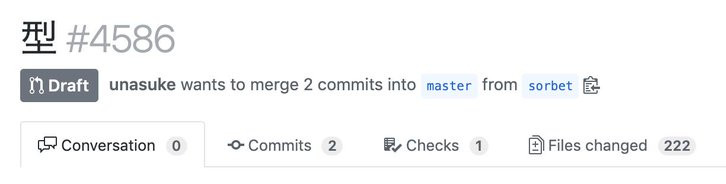
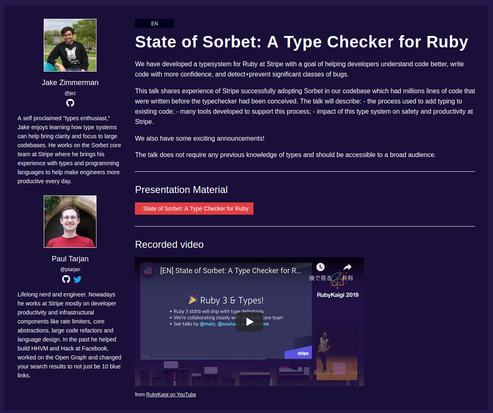
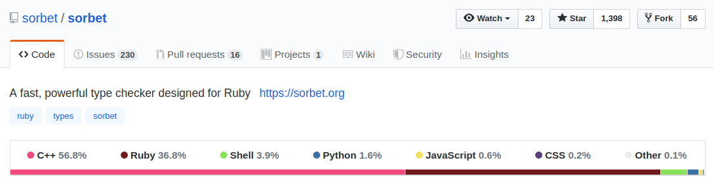
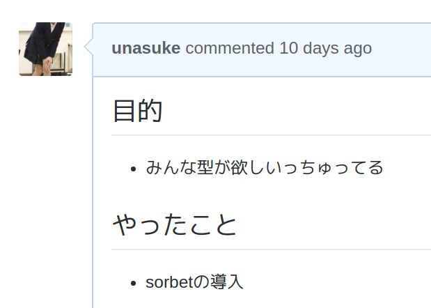
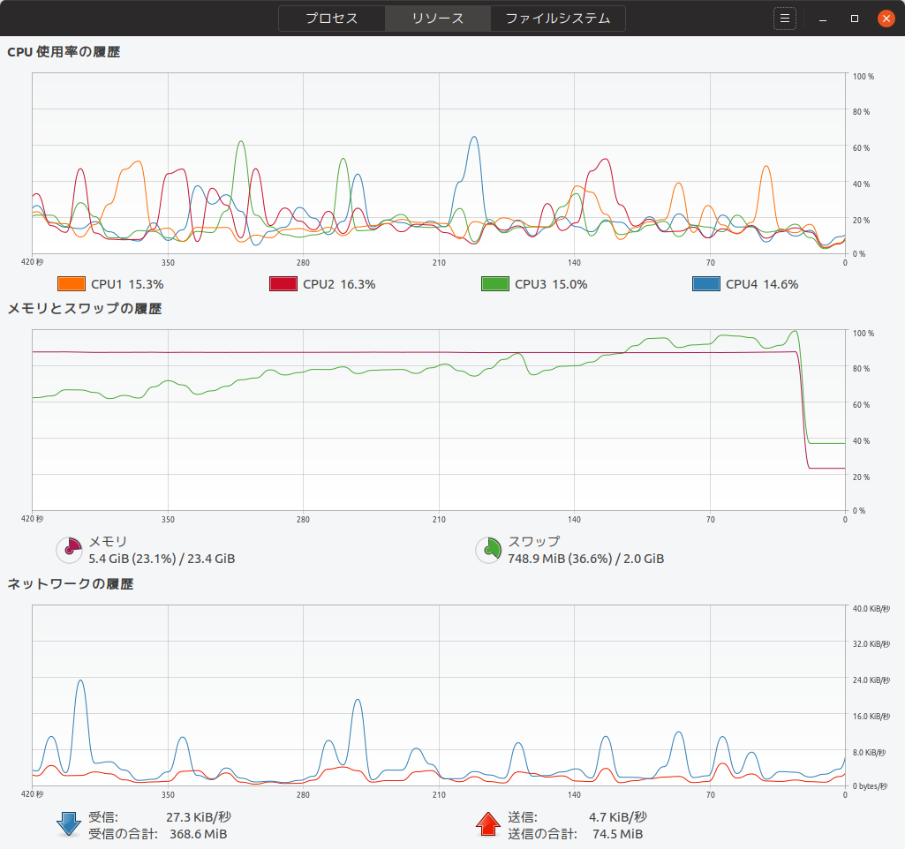
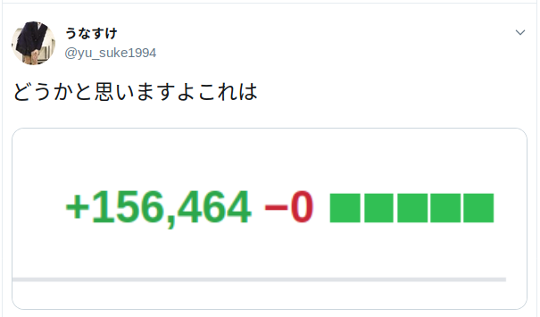
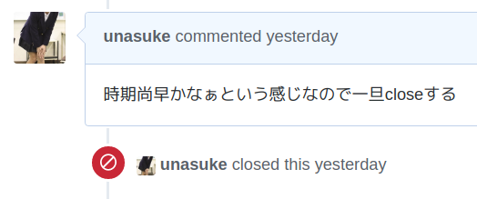
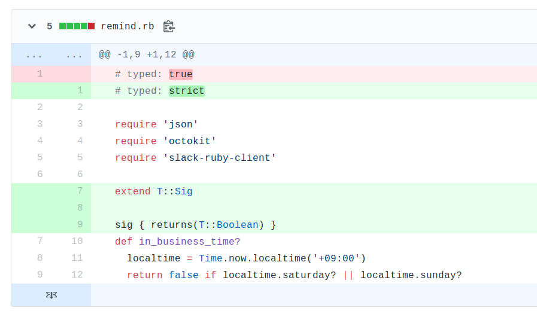

# Sorbet撤退記
subtitle
: 2019-07-04

subtitle
: 表参道.rb #48

author
: うなすけ

theme
: unasuke-white


# 自己紹介
- 名前 : うなすけ
- 仕事 : 株式会社バンク (エンジニア)
  - インフラ寄りサーバーサイドエンジニア
  - Ruby, Rails, Kubernetes...

- {::tag name="x-small"}GitHub [@unasuke](https://github.com/unasuke){:/tag}
- {::tag name="x-small"}Mastodon [@unasuke@mstdn.unasuke.com](https://mstdn.unasuke.com/@unasuke){:/tag}
- {::tag name="x-small"}Twitter [@yu\_suke1994](https://twitter.com/yu_suke1994){:/tag}

{:relative_width="24" align="right" relative_margin_right="-10" relative_margin_top="42"}

# 型
{:relative_width="85"}

<https://twitter.com/HolyGrail/status/1143030647121780737>

# 型
{:relative_width="100"}

# Sorbet
> Sorbet is a fast, powerful type checker designed for Ruby.
> Built with 💜 at Stripe.

{:relative_height="100"}

# Sorbet in RubyKaigi 2019
- <https://rubykaigi.org/2019/presentations/jez.html>
- <https://www.youtube.com/watch?v=odmlf_ezsBo>

{:relative_width="50"}

# Sorbet was public released in GitHub
{:relative_width="100"}

at 2019-06-20

<https://github.com/sorbet/sorbet>

# 「みんな型が欲しいっちゅってる」


# やること
1. `gem 'sorbet', :group => :development`
1. 自明 `bundle install`
1. `bundle exec srb init`
1. `bundle exec srb tc`

<https://sorbet.org/docs/adopting>

# bundle exec srb init → OOM Killer
{:relative_width="100"}

# bundle exec srb init → 大量の .rbi
```shell
$ ls sorbet/**/*.rbi | wc -l
471
```

# bundle exec srb typecheck めっちゃ警告
```shell
$ docker-compose exec api bundle exec srb tc | wc -l
14826
```

# We have CLI option!
```shell
$ bundle exec srb tc --typed=true
```

<https://sorbet.org/docs/cli#overriding-strictness-levels>

# We have configuration yaml!
```yaml
# -- foo.yaml --
true:
  - foo.rb
```

```shell
$ bundle exec srb tc --typed-override=foo.yaml foo.rb
```

<https://sorbet.org/docs/cli#overriding-strictness-levels>

# しかしこれは両立できない(現状は)
- 全ファイルの静的型解析を `ignore`
- 型注釈を書いたファイルは `true` 以上

ということができない！

↓↓↓↓

結果、全 `.rb` に対して `# typed: ignore` を書く？

# 末路
{:relative_width="75"}

<https://twitter.com/yu_suke1994/status/1145998714533601280>

# 結論
{:relative_width="100"}

はい……

# 理想
{:relative_width="90"}

{::tag name="x-small"}
<https://github.com/unasuke/github-notification-reminder/commit/774205a>
{:/tag}

# 参考資料
- <https://sorbet.org>
- <https://soutaro.hatenablog.com/entry/2019/06/26/145305>
- <https://speakerdeck.com/soutaro/an-introduction-to-typed-ruby-programming>
